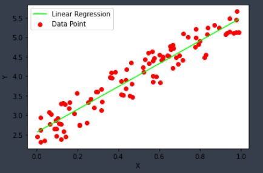

# ML-algorithms-from-scratch
Some of machine learning algorithms implemented from scratch in python:

- 'Least_squared_stat' - implement the method of Least-squares as a statistical procedure to find the best fit line for a set of data points by calculating slope and y-intercept values 

- 'Least_squared_normal_equation' - implement the Least squares method using an algebraic equation called a normal equation

- 'Gradient_descent' - computes 3 different versions of the most popular optimization algorithm: batch gradient descent, stochastic gradient descent, and mini-batch gradient descent

